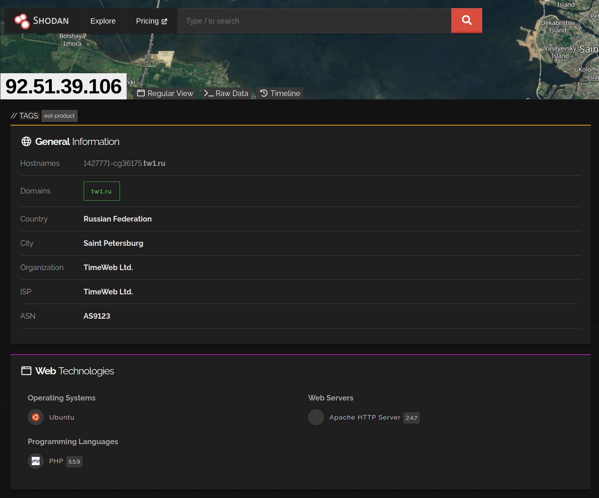
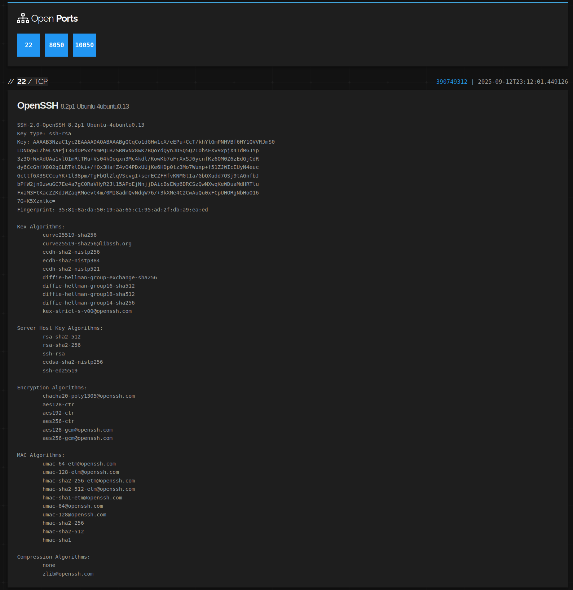
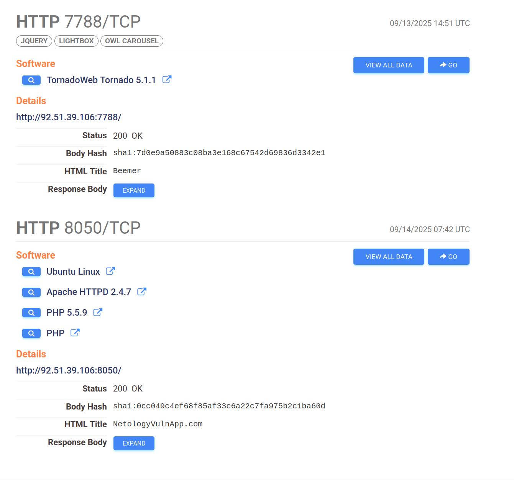
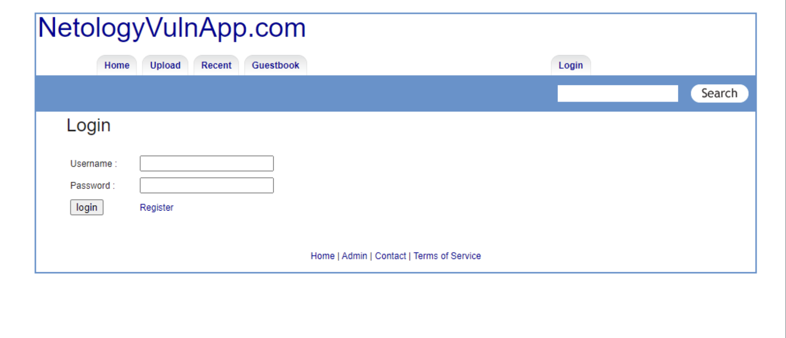

## Этап 1. OSINT

Для сбора информации о адресе использованы следующие сервисы:
- [shodan.io](https://www.shodan.io)
- [censys.io](https://search.censys.io)

Скриншот результатов:  

В результате была обнаружена следующая информация:
- Местонахождение сервера (Russia, Saint Petersburg)
- Версия ОС (Ubuntu Linux 20.04)
- Открытые порты с установленным ПО
    - 22/SSH (OpenBSD OpenSSH 8.2)
    - 7799/HTTP (веб-сайт Beemer, веб-сервер TornadoWeb Tornado 5.1.1)
    - 8060/HTTP (веб-сайт NetologyVulnApp.com, веб-сервер Apache HTTPD 2.4.7, язык PHP 5.5.9 )

Скриншоты обнаруженных сайтов:

