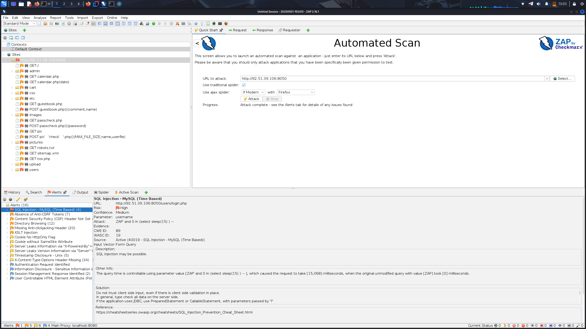
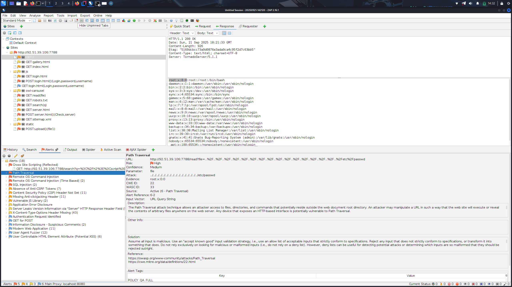

## Этап 1. OSINT

Для сбора информации об адресе использованы следующие сервисы:
- [shodan.io](https://www.shodan.io)
- [censys.io](https://search.censys.io)

Скриншот результатов:  


В результате была обнаружена следующая информация:
- Местонахождение сервера (Russia, Saint Petersburg)
- Версия ОС (Ubuntu Linux 20.04)
- Открытые порты с установленным ПО
    - 22/SSH (OpenBSD OpenSSH 8.2)
    - 7799/HTTP (веб-сайт Beemer, веб-сервер TornadoWeb Tornado 5.1.1)
    - 8060/HTTP (веб-сайт NetologyVulnApp.com, веб-сервер Apache HTTPD 2.4.7, язык PHP 5.5.9 )

Скриншоты обнаруженных сайтов:


## Этап 2. Scanning

Для сканирования хоста использовались инструменты:
- NMap
- Nikto
- DirSearch

В ходе тестирования было обнаружено, что на хосте установлена система предотвращения вторжений (FortiGuard).
Для попытки обхода данной системы снижена скорость работы сканера nmap (с помощью параметра T0) и установлен таймаут между тестами в сканере nikto (-Pause 0.4 -timeout 3)
Nmap запущен в режиме обнаружения сервисов с использованием плагина `vulners`


Результаты сканирования Nmap 92.51.39.106

```sh
nmap -sV -T4 --script vulners 92.51.39.106
Starting Nmap 7.95 ( https://nmap.org ) at 2025-09-17 15:47 EDT
Nmap scan report for 1427771-cg36175.tw1.ru (92.51.39.106)
Host is up (0.023s latency).
Not shown: 999 closed tcp ports (reset)
PORT   STATE SERVICE VERSION
22/tcp open  ssh     OpenSSH 8.2p1 Ubuntu 4ubuntu0.13 (Ubuntu Linux; protocol 2.0)
| vulners: 
|   cpe:/a:openbsd:openssh:8.2p1: 
|       PACKETSTORM:173661      9.8     https://vulners.com/packetstorm/PACKETSTORM:173661   *EXPLOIT*
|       F0979183-AE88-53B4-86CF-3AF0523F3807    9.8     https://vulners.com/githubexploit/F0979183-AE88-53B4-86CF-3AF0523F3807       *EXPLOIT*
|       CVE-2023-38408  9.8     https://vulners.com/cve/CVE-2023-38408
|       B8190CDB-3EB9-5631-9828-8064A1575B23    9.8     https://vulners.com/githubexploit/B8190CDB-3EB9-5631-9828-8064A1575B23       *EXPLOIT*
|       8FC9C5AB-3968-5F3C-825E-E8DB5379A623    9.8     https://vulners.com/githubexploit/8FC9C5AB-3968-5F3C-825E-E8DB5379A623       *EXPLOIT*
|       8AD01159-548E-546E-AA87-2DE89F3927EC    9.8     https://vulners.com/githubexploit/8AD01159-548E-546E-AA87-2DE89F3927EC       *EXPLOIT*
|       2227729D-6700-5C8F-8930-1EEAFD4B9FF0    9.8     https://vulners.com/githubexploit/2227729D-6700-5C8F-8930-1EEAFD4B9FF0       *EXPLOIT*
|       0221525F-07F5-5790-912D-F4B9E2D1B587    9.8     https://vulners.com/githubexploit/0221525F-07F5-5790-912D-F4B9E2D1B587       *EXPLOIT*
|       BA3887BD-F579-53B1-A4A4-FF49E953E1C0    8.1     https://vulners.com/githubexploit/BA3887BD-F579-53B1-A4A4-FF49E953E1C0       *EXPLOIT*
|       4FB01B00-F993-5CAF-BD57-D7E290D10C1F    8.1     https://vulners.com/githubexploit/4FB01B00-F993-5CAF-BD57-D7E290D10C1F       *EXPLOIT*
|       CVE-2020-15778  7.8     https://vulners.com/cve/CVE-2020-15778
|       C94132FD-1FA5-5342-B6EE-0DAF45EEFFE3    7.8     https://vulners.com/githubexploit/C94132FD-1FA5-5342-B6EE-0DAF45EEFFE3       *EXPLOIT*
|       2E719186-2FED-58A8-A150-762EFBAAA523    7.8     https://vulners.com/gitee/2E719186-2FED-58A8-A150-762EFBAAA523       *EXPLOIT*
|       23CC97BE-7C95-513B-9E73-298C48D74432    7.8     https://vulners.com/githubexploit/23CC97BE-7C95-513B-9E73-298C48D74432       *EXPLOIT*
|       10213DBE-F683-58BB-B6D3-353173626207    7.8     https://vulners.com/githubexploit/10213DBE-F683-58BB-B6D3-353173626207       *EXPLOIT*
|       SSV:92579       7.5     https://vulners.com/seebug/SSV:92579    *EXPLOIT*
|       CVE-2020-12062  7.5     https://vulners.com/cve/CVE-2020-12062
|       1337DAY-ID-26576        7.5     https://vulners.com/zdt/1337DAY-ID-26576     *EXPLOIT*
|       CVE-2021-28041  7.1     https://vulners.com/cve/CVE-2021-28041
|       CVE-2021-41617  7.0     https://vulners.com/cve/CVE-2021-41617
|       284B94FC-FD5D-5C47-90EA-47900DAD1D1E    7.0     https://vulners.com/githubexploit/284B94FC-FD5D-5C47-90EA-47900DAD1D1E       *EXPLOIT*
|       PACKETSTORM:189283      6.8     https://vulners.com/packetstorm/PACKETSTORM:189283   *EXPLOIT*
|       CVE-2025-26465  6.8     https://vulners.com/cve/CVE-2025-26465
|       9D8432B9-49EC-5F45-BB96-329B1F2B2254    6.8     https://vulners.com/githubexploit/9D8432B9-49EC-5F45-BB96-329B1F2B2254       *EXPLOIT*
|       85FCDCC6-9A03-597E-AB4F-FA4DAC04F8D0    6.8     https://vulners.com/githubexploit/85FCDCC6-9A03-597E-AB4F-FA4DAC04F8D0       *EXPLOIT*
|       1337DAY-ID-39918        6.8     https://vulners.com/zdt/1337DAY-ID-39918     *EXPLOIT*
|       D104D2BF-ED22-588B-A9B2-3CCC562FE8C0    6.5     https://vulners.com/githubexploit/D104D2BF-ED22-588B-A9B2-3CCC562FE8C0       *EXPLOIT*
|       CVE-2023-51385  6.5     https://vulners.com/cve/CVE-2023-51385
|       C07ADB46-24B8-57B7-B375-9C761F4750A2    6.5     https://vulners.com/githubexploit/C07ADB46-24B8-57B7-B375-9C761F4750A2       *EXPLOIT*
|       A88CDD3E-67CC-51CC-97FB-AB0CACB6B08C    6.5     https://vulners.com/githubexploit/A88CDD3E-67CC-51CC-97FB-AB0CACB6B08C       *EXPLOIT*
|       65B15AA1-2A8D-53C1-9499-69EBA3619F1C    6.5     https://vulners.com/githubexploit/65B15AA1-2A8D-53C1-9499-69EBA3619F1C       *EXPLOIT*
|       5325A9D6-132B-590C-BDEF-0CB105252732    6.5     https://vulners.com/gitee/5325A9D6-132B-590C-BDEF-0CB105252732       *EXPLOIT*
|       530326CF-6AB3-5643-AA16-73DC8CB44742    6.5     https://vulners.com/githubexploit/530326CF-6AB3-5643-AA16-73DC8CB44742       *EXPLOIT*
|       CVE-2023-48795  5.9     https://vulners.com/cve/CVE-2023-48795
|       CVE-2020-14145  5.9     https://vulners.com/cve/CVE-2020-14145
|       CVE-2016-20012  5.3     https://vulners.com/cve/CVE-2016-20012
|       CVE-2025-32728  4.3     https://vulners.com/cve/CVE-2025-32728
|       CVE-2021-36368  3.7     https://vulners.com/cve/CVE-2021-36368
|_      PACKETSTORM:140261      0.0     https://vulners.com/packetstorm/PACKETSTORM:140261   *EXPLOIT*
```

Результаты сканирования Nikto 92.51.39.106:8050
```sh
nikto -h http://92.51.39.106:8050 -timeout 2 -maxtime 600 -T 1 2 5 -nolookup
- Nikto v2.5.0
---------------------------------------------------------------------------
+ Target IP:          92.51.39.106
+ Target Hostname:    92.51.39.106
+ Target Port:        8050
+ Start Time:         2025-09-20 09:57:02 (GMT-4)
---------------------------------------------------------------------------
+ Server: Apache/2.4.7 (Ubuntu)
+ /: Retrieved x-powered-by header: PHP/5.5.9-1ubuntu4.29.
+ /: The anti-clickjacking X-Frame-Options header is not present. See: https://developer.mozilla.org/en-US/docs/Web/HTTP/Headers/X-Frame-Options
+ /: The X-Content-Type-Options header is not set. This could allow the user agent to render the content of the site in a different fashion to the MIME type. See: https://www.netsparker.com/web-vulnerability-scanner/vulnerabilities/missing-content-type-header/
+ /: Cookie PHPSESSID created without the httponly flag. See: https://developer.mozilla.org/en-US/docs/Web/HTTP/Cookies
+ Apache/2.4.7 appears to be outdated (current is at least Apache/2.4.54). Apache 2.2.34 is the EOL for the 2.x branch.
+ /: Web Server returns a valid response with junk HTTP methods which may cause false positives.
+ /admin/: PHP include error may indicate local or remote file inclusion is possible.
+ /admin/: This might be interesting.
+ /cart/: Directory indexing found.
+ /cart/: This might be interesting.
+ /css/: Directory indexing found.
+ /css/: This might be interesting.
+ /users/: Directory indexing found.
+ /users/: This might be interesting.
+ /admin/index.php: PHP include error may indicate local or remote file inclusion is possible.
+ /admin/index.php: This might be interesting: has been seen in web logs from an unknown scanner.
+ /admin/login.php: Admin login page/section found.
+ /test.php: This might be interesting.
+ 2717 requests: 0 error(s) and 18 item(s) reported on remote host
+ End Time:           2025-09-20 09:58:14 (GMT-4) (72 seconds)
---------------------------------------------------------------------------
+ 1 host(s) tested

```
Результаты сканирования Nikto 92.51.39.106:7788
```sh
 nikto -h http://92.51.39.106:7788 -timeout 2 -maxtime 600 -T 1 2 5 -nolookup

- Nikto v2.5.0
---------------------------------------------------------------------------
+ Target IP:          92.51.39.106
+ Target Hostname:    92.51.39.106
+ Target Port:        7788
+ Start Time:         2025-09-20 10:05:39 (GMT-4)
---------------------------------------------------------------------------
+ Server: TornadoServer/5.1.1
+ /: The anti-clickjacking X-Frame-Options header is not present. See: https://developer.mozilla.org/en-US/docs/Web/HTTP/Headers/X-Frame-Options
+ /: The X-Content-Type-Options header is not set. This could allow the user agent to render the content of the site in a different fashion to the MIME type. See: https://www.netsparker.com/web-vulnerability-scanner/vulnerabilities/missing-content-type-header/
+ No CGI Directories found (use '-C all' to force check all possible dirs)
+ /login.html: Admin login page/section found.
+ 2394 requests: 0 error(s) and 3 item(s) reported on remote host
+ End Time:           2025-09-20 10:06:45 (GMT-4) (66 seconds)
---------------------------------------------------------------------------
+ 1 host(s) tested
                    
```

Результаты сканирования DirSearch 92.51.39.106:7788
```sh
dirsearch -u http://92.51.39.106:7788/ -t 1 --delay 0.5 --random-agent
/usr/lib/python3/dist-packages/dirsearch/dirsearch.py:23: DeprecationWarning: pkg_resources is deprecated as an API. See https://setuptools.pypa.io/en/latest/pkg_resources.html
  from pkg_resources import DistributionNotFound, VersionConflict

  _|. _ _  _  _  _ _|_    v0.4.3                                             
 (_||| _) (/_(_|| (_| )                                                      
                                                                             
Extensions: php, aspx, jsp, html, js | HTTP method: GET | Threads: 1
Wordlist size: 11460

Output File: /home/li/reports/http_92.51.39.106_7788/__25-09-20_10-36-05.txt

Target: http://92.51.39.106:7788/

[10:36:05] Starting:                                                         
[11:41:03] 200 -    5KB - /login.html                                       
[11:59:53] 200 -    3KB - /search                                           
[12:00:39] 200 -    4KB - /server.html                                      
[12:05:09] 500 -  332B  - /static/api/swagger.json                          
[12:05:10] 500 -  332B  - /static/api/swagger.yaml
[12:05:10] 500 -  324B  - /static/dump.sql
[12:10:57] 405 -  325B  - /upload                                           
    
```

Результаты сканирования DirSearch 92.51.39.106:8050
```sh
dirsearch -u http://92.51.39.106:8050/ -t 1 --delay 0.5 --random-agent
/usr/lib/python3/dist-packages/dirsearch/dirsearch.py:23: DeprecationWarning: pkg_resources is deprecated as an API. See https://setuptools.pypa.io/en/latest/pkg_resources.html
  from pkg_resources import DistributionNotFound, VersionConflict

  _|. _ _  _  _  _ _|_    v0.4.3                                             
 (_||| _) (/_(_|| (_| )                                                      
                                                                             
Extensions: php, aspx, jsp, html, js | HTTP method: GET | Threads: 1
Wordlist size: 11460

Output File: /home/li/reports/http_92.51.39.106_8050/__25-09-20_12-21-34.txt

Target: http://92.51.39.106:8050/

[12:21:34] Starting:                                                         
[12:26:50] 403 -  292B  - /.ht_wsr.txt                                      
[12:26:55] 403 -  295B  - /.htaccess.bak1                                   
[12:26:56] 403 -  295B  - /.htaccess.orig                                   
[12:26:57] 403 -  297B  - /.htaccess.sample
[12:26:57] 403 -  295B  - /.htaccess.save
[12:26:59] 403 -  296B  - /.htaccess_extra                                  
[12:26:59] 403 -  295B  - /.htaccess_orig
[12:27:00] 403 -  293B  - /.htaccess_sc
[12:27:01] 403 -  293B  - /.htaccessBAK
[12:27:01] 403 -  293B  - /.htaccessOLD
[12:27:02] 403 -  294B  - /.htaccessOLD2
[12:27:04] 403 -  285B  - /.htm                                             
[12:27:04] 403 -  286B  - /.html
[12:27:07] 403 -  295B  - /.htpasswd_test                                   
[12:27:08] 403 -  291B  - /.htpasswds
[12:27:09] 403 -  292B  - /.httr-oauth
[12:29:52] 403 -  285B  - /.php                                             
[12:29:54] 403 -  286B  - /.php3                                            
[12:38:17] 200 -  806B  - /about.php                                        
[12:41:34] 301 -  318B  - /admin  ->  http://92.51.39.106:8050/admin/       
[12:42:36] 200 -  196B  - /admin/                                           
[12:43:26] 303 -    0B  - /admin/home.php  ->  /admin/index.php?page=login  
[12:43:30] 200 -  196B  - /admin/index.php                                  
[12:43:37] 200 -  181B  - /admin/login.php                                  
[13:02:04] 200 -  980B  - /calendar.php
[13:02:13] 301 -  317B  - /cart  ->  http://92.51.39.106:8050/cart/
[13:02:47] 403 -  289B  - /cgi-bin/
[13:02:48] 403 -  307B  - /cgi-bin/a1stats/a1disp.cgi
[13:02:49] 403 -  299B  - /cgi-bin/awstats.pl
[13:02:49] 403 -  297B  - /cgi-bin/awstats/
[13:02:50] 403 -  300B  - /cgi-bin/htimage.exe?2,2
[13:02:50] 403 -  299B  - /cgi-bin/htmlscript
[13:02:51] 403 -  301B  - /cgi-bin/imagemap.exe?2,2
[13:02:52] 403 -  299B  - /cgi-bin/index.html
[13:02:52] 403 -  294B  - /cgi-bin/login
[13:02:53] 403 -  298B  - /cgi-bin/login.cgi
[13:02:53] 403 -  298B  - /cgi-bin/login.php
[13:02:54] 403 -  302B  - /cgi-bin/mt-xmlrpc.cgi
[13:02:54] 403 -  295B  - /cgi-bin/mt.cgi
[13:02:55] 403 -  305B  - /cgi-bin/mt/mt-xmlrpc.cgi
[13:02:55] 403 -  298B  - /cgi-bin/mt/mt.cgi
[13:02:56] 403 -  306B  - /cgi-bin/mt7/mt-xmlrpc.cgi
[13:02:56] 403 -  299B  - /cgi-bin/mt7/mt.cgi
[13:02:57] 403 -  296B  - /cgi-bin/php.ini
[13:02:57] 403 -  297B  - /cgi-bin/printenv
[13:02:58] 403 -  300B  - /cgi-bin/printenv.pl
[13:02:58] 403 -  297B  - /cgi-bin/test-cgi
[13:02:59] 403 -  297B  - /cgi-bin/test.cgi
[13:03:00] 403 -  300B  - /cgi-bin/ViewLog.asp
[13:05:01] 301 -  321B  - /comments  ->  http://92.51.39.106:8050/comments/
[13:08:21] 301 -  316B  - /css  ->  http://92.51.39.106:8050/css/
[13:13:28] 200 -  851B  - /error.php
[13:20:41] 301 -  319B  - /images  ->  http://92.51.39.106:8050/images/
[13:20:41] 200 -  491B  - /images/
[13:21:04] 500 -  611B  - /include
[13:21:04] 500 -  611B  - /include/
[13:21:05] 500 -  611B  - /include/config.inc.php
[13:21:05] 500 -  611B  - /include/config.inc.aspx
[13:21:06] 500 -  611B  - /include/config.inc.jsp
[13:21:06] 500 -  611B  - /include/config.inc.html
[13:21:07] 500 -  611B  - /include/config.inc.js
[13:21:07] 500 -  611B  - /include/fckeditor
[13:21:08] 500 -  611B  - /include/fckeditor/
[13:39:35] 301 -  321B  - /pictures  ->  http://92.51.39.106:8050/pictures/
[13:46:16] 403 -  294B  - /server-status
[13:46:16] 403 -  295B  - /server-status/
[13:54:03] 200 -  113B  - /test.php
[13:56:37] 301 -  319B  - /upload  ->  http://92.51.39.106:8050/upload/
[13:56:42] 200 -  656B  - /upload/
[13:57:34] 301 -  318B  - /users  ->  http://92.51.39.106:8050/users/
[13:57:44] 200 -  568B  - /users/
[13:57:46] 200 -  949B  - /users/login.php

```

Выводы:
На исследуемом хосте 92.51.39.106 выявлен ряд серьезных проблем безопасности, связанных как с уязвимыми сервисами, так и с ошибками настройки веб-приложений.

### Критические уязвимости OpenSSH

- На порту 22 обнаружен сервис OpenSSH 8.2p1 (Ubuntu Linux), для которого выявлено множество уязвимостей с публично доступными эксплойтами:
- CVE-2023-38408 — критическая уязвимость (CVSS 9.8), позволяющая удаленное выполнение кода через forwarding.
- CVE-2020-15778 — позволяет выполнение произвольных команд при некорректной обработке scp.
- CVE-2020-12062, CVE-2021-41617, CVE-2021-28041 — локальные и удаленные уязвимости, связанные с обходом ограничений, эскалацией прав и произвольным выполнением кода.
- Для большинства перечисленных уязвимостей есть рабочие наборы эксплойтов с высокой степенью риска, часть из которых автоматизирована (GitHub Exploits, Packetstorm, etc.).
- Рекомендация: Немедленно обновить OpenSSH, ограничить доступ только по нужным адресам, применить двухфакторную аутентификацию и отключить root-login

### Проблемы безопасности Web-приложений на порту 7788          ( TornadoServer/5.1.1)

- Отсутствуют важные HTTP headers для безопасности:
    - X-Frame-Options не установлен (уязвимость к clickjacking).
    - X-Content-Type-Options не установлен (может привести к MIME-атакам).
- На сервере присутствует открытая страница /login.html (админка), что облегчает поиск входа для атакующих.
- Обнаружены критические ошибки (код 500) для ряда файлов:
    - /static/api/swagger.json, /static/api/swagger.yaml, /static/dump.sql — возможно, доступ к техническим данным или дампам БД, что сильно повышает риск утечек.
- Функция загрузки /upload возвращает 405 (запрещено), но сам маршрут существует — возможно, уязвимости при неправильной настройке методов HTTP.

### Проблемы web-настроек и потенциальные уязвимости на порту 8050

- Существенное количество файлов .htaccess*, .htpasswd*, .php и других защищённых файлов доступны и могут дать ключевую информацию об устройстве сервера даже через ошибки 403.
- Открытые административные панели: /admin/login.php, /admin/index.php — целевые точки для перебора паролей и атак на формы входа.
- Обнаружены скрипты и страницы тестирования/ошибок: /test.php, /error.php.
- Доступны директории загрузки /upload/, а также пользовательские страницы /users/login.php, что повышает риск попыток перебора и атак на формы входа.
- Наличие ошибок 500 при обращении к папке /include/ и связанным скриптам может указывать на уязвимости в обработке внутренних файлов и ошибок сервера.

### Общие и организационные риски

- Использование устаревших версий софта без актуальных патчей.
- Незащищенные файлы и директории, потенциально ведущие к раскрытию конфиденциальной информации.
- Отсутствие базовой веб-защиты (HTTP Security Headers).

## Этап 3. Testing

Тестирование приложения проводилось как в ручную, так и с помощью автоматизированного средства `Owasp Zap`

В результате автоматического тестирования были найдены следующие проблемы:
- SQL injection
- Межсайтовый скриптинг (DOM-based)
- Межсайтовый скриптинг (Reflected)
- Отсутствует заголовок (Header) для защиты от кликджекинга
- Отсутствуют токены против CSRF атак
- Просмотр каталогов
- Cookie без атрибута SameSite, HttpOnly, Strict-Transport-Security
- Заголовок X-Content-Type-Options отсутствует
  
Результат сканирования NetologyVulnApp


Результат сканирования Beemer


### Используемые инструменты:
- OWASP ZAP
- Hydra
- Sqlmap
- NMap
- Python 3 (http-server)
- Kali linux
- Visual Studio Code
- Mozilla Firefox


### Источники информации:
- [OWASP Top 10 - 2021](https://owasp.org/Top10/)
- [OWASP WSTG](https://owasp.org/www-project-web-security-testing-guide/)
- [XSS Polyglot](https://github.com/0xsobky/HackVault/wiki/Unleashing-an-Ultimate-XSS-Polyglot)
- [Exploit-db](https://www.exploit-db.com/)

---

## Этап 4. Создание отчёта

Ниже представлены ссылки на подробное описание и примеры реализации уязвимостей.
- [**NetologyVulnApp**] [NetologyVulnApp.md](NetologyVulnApp.md)
- [**Beemer**][Beemer.md](Beemer.md)
